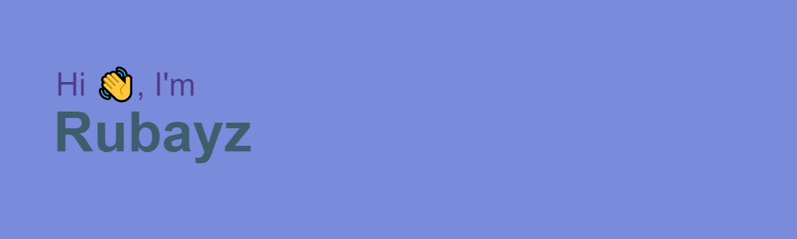

### Hi there 

<h2>I am Muhammad Aaraf Rubayz. I am 13 years old and having a greater experience everyday!🙂. I am learning web development in the intermediate level. I also know python and c++ basics. I am currently looking for someone friendly and have a great experience in coding.
  I also want to know about Robotics🤖. So, I participated in an Arduino workshop and learnt some basics too! Working on web development with studies ahead.👨‍🎓. </h2>
  
  <h1>📈 Github Stats</h1>
 
 
<!--
**Rubayz/Rubayz** is a ✨ _special_ ✨ repository because its `README.md` (this file) appears on your GitHub profile.

Here are some ideas to get you started:. 

- 🔭 I’m currently working on ...
- 🌱 I’m currently learning ...
- 👯 I’m looking to collaborate on ...
- 🤔 I’m looking for help with ...
- 💬 Ask me about ...
- 📫 How to reach me: ...
- 😄 Pronouns: ...
- ⚡ Fun fact: ...
-->
